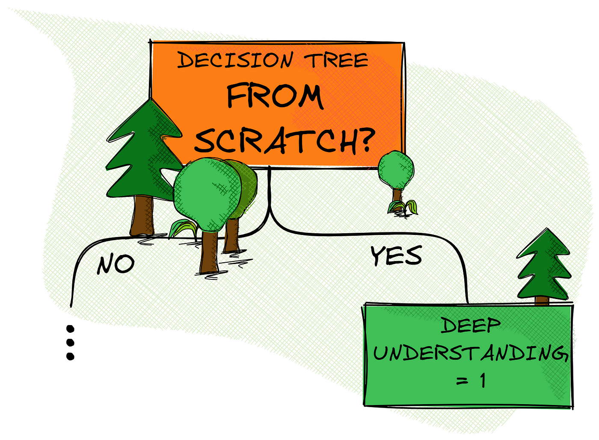

# Decision-Tree-from-scratch
Building a model from scratch helps truly understand how it works. While libraries give us quick results, this project dives into the math and logic behind decision trees — from entropy and information gain to the recursive tree-building process.

  

 *Why Build From Scratch?*
Understanding any machine learning model deeply often begins with writing it from the ground up. While libraries like Scikit-learn let us use DecisionTreeClassifier in just a few lines of code, we miss the mathematical logic, tree structure, and decision-making process that makes the algorithm so powerful.

*This project helped me:*

* Grasp the real working of splits, entropy, information gain, etc.
* Translate the theoretical steps into working Python code.
* Appreciate the model more than ever before!
  
*What's Inside?*

✅ Full implementation of Decision Tree for Classification.

✅ Custom functions for Entropy, Gini Impurity, and Information Gain

✅ Tree-building logic using recursive partitioning

✅ Support for both categorical and numerical features

✅ Cleanly structured Python code with comments

✅ 📚 A "Digital Notes PDF" covering all concepts step-by-step

*Learning Resources Included*

I've attached a digital notes PDF that:

* Explains all theoretical concepts (Entropy, Gain, Gini, etc.)
* Shows manual calculations and step-by-step derivations
* Gives clarity on recursive tree construction
  
Building this from scratch wasn’t easy, but it really helped me understand how decision trees work. There’s still a lot to improve, but this was a solid step forward — and a reminder that real learning comes with a bit of struggle and a lot of curiosity.
